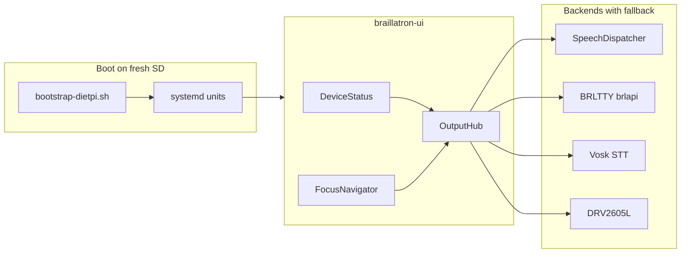

# Braillatron: Graceful Offline Boot, Deploy, ScreenReader, and OS Storage

## Context and constraints

- **Target:** Orange Pi 3B, fresh **DietPi (Debian Trixie, vendor kernel 6.1.115)** on **SD card** ([Skeleton Build Guide](mobile-braille-embosser/specs/Skeleton%20Prototype%20V4%20Build%20Guide%20&%20BOM.md)).
- **Arduino:** defer firmware work; Pi-side heartbeat only when serial is present.
- **Orca note:** Orca drives **AT-SPI/GTK desktop apps**. Our custom UI is a C++ focus navigator ([`focus_nav.cpp`](mobile-braille-embosser/daemon-dietpi/src/keyboard/focus_nav.cpp)), not a GTK app. The correct integration path is:
  - **Custom daemon → Speech Dispatcher (eSpeak-ng) + BRLTTY (libbraille) + Vosk + DRV2605L** directly.
  - **Orca + at-spi** installed and documented for future standard Linux apps (editor, BARD browser), not wired into the keyboard daemon itself.

## Current gaps (why the keyboard daemon dies today)

| Component | Today | Needed |
|-----------|-------|--------|
| Serial missing | `SerialListener` throws → exit 1 | Start in degraded mode; announce "keyboard unavailable" |
| I2C missing | Silent `valid=false` | One-time + periodic user-visible status |
| GPIO missing | Indistinguishable from inactive | Explicit `unavailable` vs `inactive` |
| UI output | [`global_hooks.cpp`](mobile-braille-embosser/daemon-dietpi/src/keyboard/global_hooks.cpp) stubs | Output Hub with fallbacks |
| Deploy | None | systemd + install scripts |
| Storage | [`ram_text_persistence.cpp`](mobile-braille-embosser/daemon-dietpi/src/telemetry/ram_text_persistence.cpp) only | `/data` mount + rsync timer |



---

## Phase 1 — Device status and graceful degradation (daemon code)

Add shared module [`daemon-dietpi/src/platform/device_status.{h,cpp}`](mobile-braille-embosser/daemon-dietpi/src/platform/device_status.{h,cpp}):

- Probe at startup (and every N seconds): serial (`access()` + optional non-blocking open), I2C bus + LTC2944/DRV2605L addresses, GPIO sysfs paths, Speech Dispatcher socket, BRLTTY brlapi, Vosk model path, audio sink.
- Each device gets: `Connected | Missing | Degraded` + human label + last error string.
- Emit structured log lines to **stderr/journal** (`[status] arduino: missing (/dev/ttyACM0)`).
- Expose `DeviceStatusReport` for the UI hub and a **System Status** focus menu.

**Serial / keyboard changes** ([`serial_listener.cpp`](mobile-braille-embosser/daemon-dietpi/src/keyboard/serial_listener.cpp), [`keyboard_service.cpp`](mobile-braille-embosser/daemon-dietpi/src/keyboard/keyboard_service.cpp)):

- Add `allow_missing_arduino=true` to [`hardware.conf`](mobile-braille-embosser/daemon-dietpi/config/hardware.conf) (default **true** for skeleton).
- If serial unavailable: skip worker thread, set status `Missing`, still run focus nav + chord polling (no-op without input).
- If serial drops at runtime: log once, update status, attempt reconnect on probe interval.

**Telemetry changes** ([`telemetry_sentinel.cpp`](mobile-braille-embosser/daemon-dietpi/src/telemetry/telemetry_sentinel.cpp), [`limit_sensors.cpp`](mobile-braille-embosser/daemon-dietpi/src/telemetry/limit_sensors.cpp)):

- Log I2C open failure once at startup.
- GPIO: distinguish `path empty` / `file missing` (unavailable) from `read 0` (inactive).
- Fix [`sentinel_main.cpp`](mobile-braille-embosser/daemon-dietpi/src/sentinel_main.cpp) to load telemetry path from `hardware.conf` → `telemetry_config` (currently hardcoded).

**Pi-side heartbeat** (no Arduino changes):

- Add optional TX path in a small [`platform/serial_link.{h,cpp}`](mobile-braille-embosser/daemon-dietpi/src/platform/serial_link.cpp) using existing [`shared/protocol.h`](mobile-braille-embosser/shared/protocol.h) `BRAILLATRON_OP_HEARTBEAT` (zero-payload frame).
- Only active when serial is `Connected`; otherwise skip silently.

---

## Phase 2 — ScreenReader UI Output Hub and accessibility backends

New package under [`daemon-dietpi/src/ui/`](mobile-braille-embosser/daemon-dietpi/src/ui/):

| File | Role |
|------|------|
| `output_hub.{h,cpp}` | Central fan-out on focus change, boundary, errors, status |
| `backends/tts_spd.{h,cpp}` | Speech Dispatcher client (`spd_open` / `spd_say`); fallback `espeak-ng` subprocess |
| `backends/brltty_api.{h,cpp}` | BRLTTY via `libbraille` / brlapi; no-op + status if no display |
| `backends/stt_vosk.{h,cpp}` | Vosk model load + PTT gate; wire [`global_hooks.cpp`](mobile-braille-embosser/daemon-dietpi/src/keyboard/global_hooks.cpp) |
| `backends/haptics.{h,cpp}` | Extend [`drv2605l.cpp`](mobile-braille-embosser/daemon-dietpi/src/telemetry/drv2605l.cpp) with `play_effect(id)` for UI (boundary double-click = effect 3 per spec) |
| `menu_overlay.{h,cpp}` | Global overlay state pushed by Menu key; reuses focus model |
| `ui.conf` | Backend enable flags, SPD voice, Vosk model path, haptic effect IDs |

**Wire into existing keyboard flow:**

- [`FocusNavigator`](mobile-braille-embosser/daemon-dietpi/src/keyboard/focus_nav.cpp): add `on_focus_changed` callback (after D-pad moves).
- [`KeyboardService`](mobile-braille-embosser/daemon-dietpi/src/keyboard/keyboard_service.cpp): replace empty activate handler; seed menu: `Document`, `Settings`, `System Status`, `Emboss`, `Power`.
- On startup: hub announces `"Braillatron ready"` + summary of missing devices (spoken + braille + journal).
- Shift/TTS hook → `spd_pause` / `spd_resume`; Speech hook → Vosk PTT; Menu hook → overlay.

**Rename binary target:** `braillatron-keyboard` → **`braillatron-ui`** (Makefile alias kept for dev). Single process owns keyboard + hub (focus events must be in-process).

**Build deps** (document in `deploy/packages.txt`, `-l` flags in Makefile):

- `libspeechd-dev`, `libbrlapi-dev`, `libvosk` (or vendored `.so` + model tarball), existing I2C unchanged.

---

## Phase 3 — Systemd units and deploy scripts

New directory [`mobile-braille-embosser/deploy/`](mobile-braille-embosser/deploy/):

```
deploy/
  install.sh              # build, install bins + configs, enable units
  bootstrap-dietpi.sh     # first-run on fresh SD (calls os/* + packages)
  packages.txt            # apt packages
  config/
    braillatron.conf      # master paths (/etc/braillatron/)
    ui.conf
    hardware.conf
    telemetry.conf
  systemd/
    braillatron-ui.service
    braillatron-sentinel.service
    braillatron-sync.service
    braillatron-sync.timer
    braillatron.target     # Wants all three
  os/
    setup-data-partition.sh   # SD: shrink root or use parted to add /data ext4
    setup-overlay-ro.sh       # DietPi overlay + RO root (post-install)
    fstab.snippet
    asound.conf.snippet       # I2S default sink placeholder
    sync-documents.sh         # rsync RAM buffer → /data/braillatron/documents
```

**Install layout:**

| Path | Contents |
|------|----------|
| `/usr/local/bin/braillatron-ui` | UI + keyboard + hub |
| `/usr/local/bin/braillatron-sentinel` | Telemetry |
| `/usr/local/bin/braillatron-sync` | One-shot rsync |
| `/etc/braillatron/*.conf` | Config (editable on `/data` overlay in prod) |
| `/var/lib/braillatron/ram/` | RAM document layers |
| `/data/braillatron/documents/` | Persistent `.brf` (SD partition) |

**systemd behavior (no hardware):**

- `Restart=on-failure`, `RestartSec=5`
- `WorkingDirectory=/etc/braillatron` or env `BRAILLATRON_CONFIG=/etc/braillatron`
- Units start even if Arduino/I2C absent; status goes to journal (`journalctl -u braillatron-ui`)

**Makefile:** add `install` target delegating to `deploy/install.sh`.

---

## Phase 4 — OS and storage infrastructure (fresh SD)

[`deploy/os/setup-data-partition.sh`](mobile-braille-embosser/deploy/os/setup-data-partition.sh):

- SD-only: use `parted`/`growpart` to add ext4 **`/data`** (~512MB–1GB for prototype).
- Add fstab entry; create `/data/braillatron/{documents,settings,vosk-models}`.
- Update [`telemetry.conf`](mobile-braille-embosser/daemon-dietpi/config/telemetry.conf) defaults: `persistent_output_dir=/data/braillatron/documents`, RAM layers under `/var/lib/braillatron/ram/`.

[`deploy/os/setup-overlay-ro.sh`](mobile-braille-embosser/deploy/os/setup-overlay-ro.sh):

- DietPi-compatible RO root + tmpfs overlay for `/var/log`, `/var/tmp`, `/tmp` (per [`.cursorrules`](mobile-braille-embosser/.cursorrules)).
- **Exception mounts:** `/data` and `/var/lib/braillatron` remain RW.
- Document manual step: run once, then reboot; provide `braillatron-ro-off.sh` for dev maintenance.

[`deploy/os/sync-documents.sh`](mobile-braille-embosser/deploy/os/sync-documents.sh):

- `rsync -a --delete-after` from RAM layers to `/data/braillatron/documents/` using same atomic pattern as [`ram_text_persistence.cpp`](mobile-braille-embosser/daemon-dietpi/src/telemetry/ram_text_persistence.cpp).
- Triggered by `braillatron-sync.timer` (every 60s) + on sentinel shutdown path.

[`deploy/bootstrap-dietpi.sh`](mobile-braille-embosser/deploy/bootstrap-dietpi.sh) orchestration on fresh SD:

1. `apt install` from `packages.txt`
2. Enable I2S overlay (`rk3566-i2s1-overlay` per build guide)
3. Run data partition + overlay scripts
4. Download Vosk small English model to `/data/braillatron/vosk-models/`
5. Enable `speech-dispatcher`, `brltty`, `pipewire` (or wireplumber)
6. Run `install.sh` and `systemctl enable braillatron.target`

**Audio stack on DietPi:** configure PipeWire/WirePlumber default sink to I2S (`asound.conf.snippet`); Speech Dispatcher output module `espeak-ng`; verify with `spd-say "test"` in bootstrap.

---

## Phase 5 — Host-side verification (no Pi required)

- Extend Makefile with `make ui-self-test`: mock backends, verify hub announces missing devices.
- Existing `braillatron-motion-test` unchanged.
- CI-friendly: `make all` on dev PC; full accessibility backends gated behind `#ifdef BRAILLATRON_HAS_SPD` with stub backends for host builds.

---

## What we need from you (before or during implementation)

These are **not blockers** for scaffolding, but needed for a working Pi image:

1. **DietPi image confirmation** — Orange Pi 3B image URL/version you will flash (ideally Trixie + kernel 6.1.115 per spec). We will pin bootstrap steps to that image.
2. **GPIO sysfs paths** when you wire limit sensors (TCRT5000, TCST2103). Placeholders are fine until breadboard bring-up; you can fill `/etc/braillatron/telemetry.conf` later.
3. **Vosk model size preference** — default plan: `vosk-model-small-en-us-0.15` (~40MB) on `/data`; say if you want a larger model.
4. **Orca expectation** — confirm you accept **Speech Dispatcher + BRLTTY as the primary integration** for the custom C++ UI, with Orca installed for future GTK/web apps rather than wrapping the keyboard daemon in AT-SPI.
5. **SSH/network on first boot** — how you reach the Pi after flashing (Ethernet, WiFi credentials in DietPi setup) so bootstrap can be run non-interactively or documented step-by-step.

No external docs beyond what's already in [`specs/`](mobile-braille-embosser/specs/) are required to start; the Skeleton Build Guide covers I2S/GPIO/UART pin references.

---

## Suggested implementation order

1. Device status + graceful serial (unblocks "boot with nothing connected")
2. Output Hub + SPD/BRLTTY/Vosk backends with fallbacks
3. systemd + install.sh (dev loop on PC cross-compile or Pi)
4. OS bootstrap scripts (/data + overlay + rsync)
5. Pi-side heartbeat (when serial present)
6. Update [`shared/protocol.md`](mobile-braille-embosser/shared/protocol.md) to match implemented heartbeat behavior
