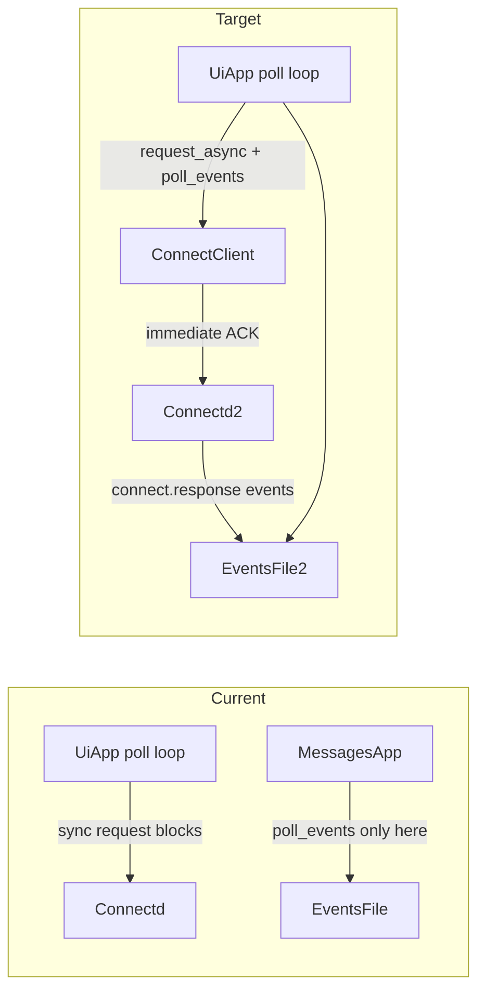
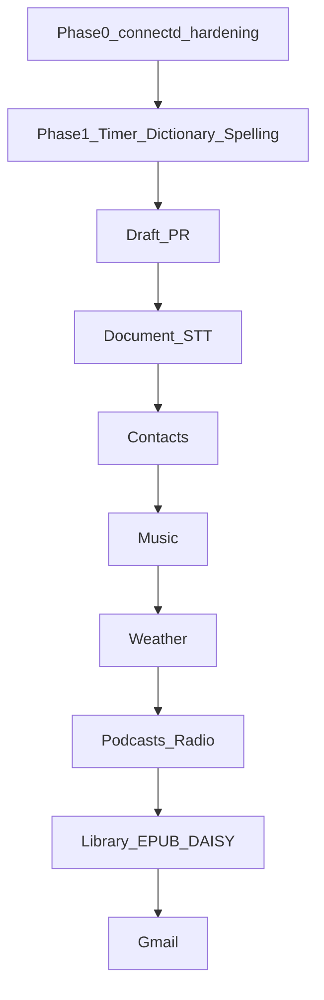

# Multi-App Integration v1.2

## Current baseline

Repository is on `main` ([621f626](621f626)); target branch `cursor/multi-app-integration-205d` does not exist yet — create it before first commit.

**Existing patterns to follow:**

- App registration: `[app_registry.cpp](mobile-braille-embosser/daemon-dietpi/src/ui/apps/app_registry.cpp)` + `[all_apps.h](mobile-braille-embosser/daemon-dietpi/src/ui/apps/all_apps.h)` + `APP_OBJS` in `[Makefile](mobile-braille-embosser/daemon-dietpi/Makefile)`
- Connect IPC: sync JSON RPC in `[connect_client.cpp](mobile-braille-embosser/daemon-dietpi/src/connect/connect_client.cpp)`; events via append-only file
- STT: Transcriber wires `set_stt_transcript_handler` in `[transcriber_app.cpp](mobile-braille-embosser/daemon-dietpi/src/ui/apps/transcriber_app.cpp)`; Document does not
- Media: `[youtube_backend.cpp](mobile-braille-embosser/daemon-dietpi/src/connect/youtube_backend.cpp)` + `[mpv_ipc.cpp](mobile-braille-embosser/daemon-dietpi/src/connect/mpv_ipc.cpp)`
- Settings toggles: `[output_hub.cpp](mobile-braille-embosser/daemon-dietpi/src/ui/output_hub.cpp)` `toggle_bool` pattern
- Validation: `make check` in `daemon-dietpi/` runs motion, chord, wikipedia, ui self-tests

**Known gaps (Phase 2 P0 + Phase 4 from [Connectivity Follow-Up Checklist](mobile-braille-embosser/specs/Connectivity Follow-Up Checklist.md)):**

- `signal.finish_link` blocks UI up to 120s via synchronous `ConnectClient::request()` in Settings (`[output_hub.cpp:737-748](mobile-braille-embosser/daemon-dietpi/src/ui/output_hub.cpp)`)
- `ConnectClient::poll_events()` only called in YouTube/Messages apps, not `[UiApp::poll()](mobile-braille-embosser/daemon-dietpi/src/ui/ui_app.cpp)`
- No request IDs or async command responses anywhere




---

## Phase 0 — connectd hardening (prerequisite for all network apps)

### 0a. Async connect IPC (implement Phase 4 early)

**Protocol changes (connectd + client):**


| Layer      | Change                                                                                                                                                 |
| ---------- | ------------------------------------------------------------------------------------------------------------------------------------------------------ |
| Request    | Optional `"request_id":"<uuid>"` on all commands; connectd generates one if omitted                                                                    |
| Long ops   | Immediate response: `{"ok":true,"request_id":"...","pending":true}` then background job                                                                |
| Completion | Event: `{"event":"connect.response","data":{"request_id":"...","ok":true,"result":{...}}}`                                                             |
| Client API | Add `ConnectClient::request_async(cmd, fields, callback)` + pending map; keep sync `request()` for fast ops (`ping`, `accounts.status`) with 500ms cap |


**Files to modify/create:**

- `[connect_service.cpp](mobile-braille-embosser/daemon-dietpi/src/connect/connect_service.cpp)` — job queue thread; dispatch long handlers async
- `[connect_client.h/.cpp](mobile-braille-embosser/daemon-dietpi/src/connect/connect_client.h)` — async API + correlate `connect.response` events
- `[signal_backend.cpp](mobile-braille-embosser/daemon-dietpi/src/connect/signal_backend.cpp)` — move `finish_link` wait loop to background job
- New: `connect_job_queue.cpp` (or inline in connect_service) for worker thread

**Migrate blocking callers first:** Settings Signal link, then all future backends (Gmail, weather, RSS).

### 0b. Non-blocking Signal link

- Add `signal.link_status` command → `{linked: bool, uri: string, pending: bool}`
- Emit `signal.link_completed` event when link succeeds
- Refactor Settings → **Link Signal** (`[output_hub.cpp](mobile-braille-embosser/daemon-dietpi/src/ui/output_hub.cpp)`):
  1. `request_async("signal.start_link")` → announce URI
  2. Poll `link_status` via async (or listen for `signal.link_completed`) — **never call blocking `finish_link` from UI thread**
- Deprecate or make `signal.finish_link` internal-only (connectd background)

### 0c. Global event polling

In `[UiApp::poll()](mobile-braille-embosser/daemon-dietpi/src/ui/ui_app.cpp)`:

```cpp
connect_client_.poll_events([this](const ConnectEvent &e) {
    output_hub_.on_connect_event(e);  // new centralized handler
    connect_client_.dispatch_async_responses(e);
});
```

- Move `message.received` handling from `[messages_app.cpp](mobile-braille-embosser/daemon-dietpi/src/ui/apps/messages_app.cpp)` to `OutputHub::on_connect_event` (TTS + haptic globally)
- YouTube apps keep app-specific `youtube.*` handlers in `on_poll` or register interest via OutputHub
- Add connect objects to `UI_TEST_OBJS` (checklist P2 item)

**Checklist updates:** mark Phase 2 P0 items + Phase 4 async IPC complete in [Connectivity Follow-Up Checklist](mobile-braille-embosser/specs/Connectivity Follow-Up Checklist.md).

---

## Phase 1 — Draft PR milestone (Timer + Dictionary + Spelling)

Branch: `cursor/multi-app-integration-205d`  
Draft PR when Phase 0 + Phase 1 pass `make check`.

### 1. Timer (inline)

**Architecture note:** Current inline apps only receive `on_enter` from menu (`[app_registry.cpp:171-194](mobile-braille-embosser/daemon-dietpi/src/ui/apps/app_registry.cpp)`); `on_poll`/`on_control` route only to `active_` standalone app. Timer needs background countdown while menu is closed.

**Approach:**

- New `TimerService` (in `[timer_inline.cpp](mobile-braille-embosser/daemon-dietpi/src/ui/apps/timer_inline.cpp)`) owned by `[UiApp](mobile-braille-embosser/daemon-dietpi/src/ui/ui_app.h)`
- `UiApp::poll()` calls `timer_service_.tick(now_ms())` every frame
- Extend `AppRegistry` with optional `active_inline_` session: when Timer inline menu item selected, set `active_inline_` and route D-pad/Enter/Backspace until Back exits setup (fixes same gap as `[paper_nav_inline.cpp](mobile-braille-embosser/daemon-dietpi/src/ui/apps/paper_nav_inline.cpp)`)
- Modes: Countdown, Stopwatch, Pomodoro (25/5 defaults in config)
- Alerts: TTS + haptic + optional Morse via existing `OutputHub` APIs
- Persist to `/data/braillatron/timer/state.json`
- Optional stretch: Quick Status long-press announces remaining time

**Registration:** `make_timer_inline()` in `[all_apps.h](mobile-braille-embosser/daemon-dietpi/src/ui/apps/all_apps.h)`, `register_app` in app_registry, `timer_inline.o` in `APP_OBJS`.

**Self-test:** `timer_self_test.cpp` — countdown tick, alert firing, state persistence round-trip.

### 2. Dictionary (standalone, offline)

**Data pipeline:**

- Build-time script `[deploy/install-dictionary-data.sh](mobile-braille-embosser/deploy/install-dictionary-data.sh)`: download/preprocess [kaikki.org English](https://kaikki.org/dictionary/English/) JSONL → compact SQLite at `/data/braillatron/dictionary/en.sqlite`
- First dependency on SQLite in project — add `-lsqlite3` to `Makefile` behind `BRAILLATRON_DICTIONARY=1` or always-on for daemon

**Runtime modules:**

- `[dictionary_store.cpp](mobile-braille-embosser/daemon-dietpi/src/documents/dictionary_store.cpp)` — `lookup(word) → definitions[]`, FTS or prefix index
- `[dictionary_app.cpp](mobile-braille-embosser/daemon-dietpi/src/ui/apps/dictionary_app.cpp)` — focus-nav: search field (Perkins + optional STT via existing PTT) → result list → TTS/braille/emboss actions
- `[deploy/config/dictionary.conf](mobile-braille-embosser/deploy/config/dictionary.conf)` — db path, max definitions, emboss toggle
- Stub hook in Document: menu item "Look up" on future word selection (no-op announce for v1)

**Self-test:** `dictionary_self_test.cpp` — open bundled test SQLite, verify lookup for known lemmas.

### 3. Spelling (standalone, offline)

**Data pipeline:**

- `[deploy/install-spelling-data.sh](mobile-braille-embosser/deploy/install-spelling-data.sh)`: at deploy/build time, trim and convert:
  - [wordsIK](https://github.com/Philip-Walsh/wordsIK) grade lists → JSON
  - [VXGL](https://github.com/maafiah/VXGL) level-filtered subset → JSON
  - [grundwortschatz-voc-en](https://huggingface.co/datasets/cstr/grundwortschatz-voc-en) UK statutory lists → JSON
- Install to `/usr/share/braillatron/spelling/` (read-only bundle)
- User imports via LocalSend → `/data/braillatron/spelling-lists/` (CSV `word` per line or JSON `{"words":[...]}`)

**Runtime modules:**

- `[spelling_list_store.cpp](mobile-braille-embosser/daemon-dietpi/src/documents/spelling_list_store.cpp)` — load bundled + custom lists; grade/week metadata
- `[spelling_app.cpp](mobile-braille-embosser/daemon-dietpi/src/ui/apps/spelling_app.cpp)`:
  - Menu: Source → Grade/Week → Mode (Learn / Quiz / Review missed)
  - Learn: TTS word + optional sentence; braille display; optional emboss
  - Quiz: TTS word only; Perkins input; Enter submit; score feedback
  - Sessions → `/data/braillatron/spelling-sessions/<timestamp>.json`
- `[deploy/config/spelling.conf](mobile-braille-embosser/deploy/config/spelling.conf)` — default list, US/UK liblouis table (`ueb_g2` vs `en_GB_g2`), sentence TTS on/off
- Settings toggle: US vs UK table (reuse `UiConfig.braille_table` or spelling-specific override)

**Self-test:** `spelling_self_test.cpp` — CSV/JSON import, quiz scoring, missed-word review queue.

### Phase 1 cross-cutting


| Task           | Files                                                                                                                                                                                                                           |
| -------------- | ------------------------------------------------------------------------------------------------------------------------------------------------------------------------------------------------------------------------------- |
| Register apps  | `[app_registry.cpp](mobile-braille-embosser/daemon-dietpi/src/ui/apps/app_registry.cpp)`, `[all_apps.h](mobile-braille-embosser/daemon-dietpi/src/ui/apps/all_apps.h)`, `Makefile` `APP_OBJS` + `CONNECT_COMMON_OBJS` if needed |
| Config install | `[deploy/install.sh](mobile-braille-embosser/deploy/install.sh)` — copy `dictionary.conf`, `spelling.conf`; create data dirs                                                                                                    |
| `make check`   | Add `dictionary_self_test`, `spelling_self_test`, `timer_self_test` targets                                                                                                                                                     |
| Spec updates   | [Appendix A](mobile-braille-embosser/specs/Master%20Software%20Architecture%20V9.md) — Timer, Dictionary, Spelling → Implemented; connectd hardening noted                                                                      |


**Draft PR:** push branch, `gh pr create --draft` with Phase 1 summary + test plan (`make check`, USB keyboard bench per README).

---

## Phase 2 — Document STT bridge

Wire push-to-talk dictation into Document (`[brailler_app.cpp](mobile-braille-embosser/daemon-dietpi/src/ui/apps/brailler_app.cpp)`):

- On enter (when `ui_config.document_dictation_enabled`): register STT handler like Transcriber but append to BRF at cursor via `brf_->append_char` / `append_line` instead of auto-emboss
- **EditSession guard:** skip dictation injection when `edit->state()` is `ReplacementLine`, `LineReview`, or `AwaitFullCell` (`[edit_session.h](mobile-braille-embosser/daemon-dietpi/src/documents/edit_session.h)`); queue finals or announce "Dictation paused during edit"
- Reuse `dictation_active` chrome indicator (`[output_hub.cpp](mobile-braille-embosser/daemon-dietpi/src/ui/output_hub.cpp)` already sets it during PTT)
- Settings toggle in `[build_settings_menu()](mobile-braille-embosser/daemon-dietpi/src/ui/output_hub.cpp)`: "Dictation in Document: On/Off" → new `UiConfig` field + `[ui_config.h](mobile-braille-embosser/daemon-dietpi/src/ui/ui_config.h)`
- Transcriber unchanged (continuous listen-and-emboss)

---

## Phase 3 — Contacts (offline)

- `[contacts_store.cpp](mobile-braille-embosser/daemon-dietpi/src/ui/apps/contacts_store.cpp)` — JSON or SQLite at `/data/braillatron/contacts/contacts.json`
- CSV + vCard import from `/data/braillatron/contacts/import/`
- `[contacts_app.cpp](mobile-braille-embosser/daemon-dietpi/src/ui/apps/contacts_app.cpp)` — search → detail → actions (copy, emboss card)
- `[deploy/config/contacts.conf](mobile-braille-embosser/deploy/config/contacts.conf)`
- Self-test: CSV/vCard parse round-trip

---

## Phase 4 — Local Music Player

- Shared mpv instance: extract from YouTube into `[music_backend.cpp](mobile-braille-embosser/daemon-dietpi/src/connect/music_backend.cpp)` (or generalize `MpvIpc` owner in connectd)
- Commands: `music.scan`, `music.play`, `music.pause`, `music.next`, `music.prev`, `music.seek`
- Scan `/data/braillatron/music/` + `credentials/incoming/`
- `[music_app.cpp](mobile-braille-embosser/daemon-dietpi/src/ui/apps/music_app.cpp)` — Artists → Albums → Tracks focus tree
- Reuse `set_media_playing` + Shift/TTS pause from YouTube pattern
- State: `/data/braillatron/music/state.json` (last track, position)

---

## Phase 5 — Weather

- `[weather_backend.cpp](mobile-braille-embosser/daemon-dietpi/src/connect/weather_backend.cpp)` — async fetch Open-Meteo (no API key); cache to `/data/braillatron/weather/cache.json`
- `[weather_app.cpp](mobile-braille-embosser/daemon-dietpi/src/ui/apps/weather_app.cpp)` — Current / Hourly / Daily focus lists
- `[deploy/config/weather.conf](mobile-braille-embosser/deploy/config/weather.conf)` — lat/lon or city name, provider URL
- Quick Status extension: temp/conditions when cache fresh

---

## Phase 6 — Podcasts + Internet Radio

**Podcasts:**

- `[rss_backend.cpp](mobile-braille-embosser/daemon-dietpi/src/connect/rss_backend.cpp)` — fetch RSS/Atom, parse enclosures, download episodes async
- OPML import from LocalSend
- `[podcasts_app.cpp](mobile-braille-embosser/daemon-dietpi/src/ui/apps/podcasts_app.cpp)` — Subscriptions → Episodes
- Playback via shared music/mpv backend
- systemd timer or connectd periodic refresh on Wi-Fi

**Radio:**

- `[radio_backend.cpp](mobile-braille-embosser/daemon-dietpi/src/connect/radio_backend.cpp)` — station list JSON (bundled starter + Radio Browser API fetch async)
- Stream via mpv; ICY metadata → TTS announce on change
- `[radio_app.cpp](mobile-braille-embosser/daemon-dietpi/src/ui/apps/radio_app.cpp)`
- Favorites: `/data/braillatron/radio/favorites.json`

---

## Phase 7 — EPUB/DAISY Library extension

Replace scaffold in `[library_app.cpp](mobile-braille-embosser/daemon-dietpi/src/ui/apps/library_app.cpp)`:

- **Phase 7a:** EPUB (ZIP + OPF/spine/nav) — evaluate minimal C++(e.g. miniz + hand-rolled OPF parser) vs connectd Python helper subprocess; prefer C++ in daemon for offline reliability
- **Phase 7b:** DAISY 3 text+nav (OPF + NCX); defer SMIL audio sync
- Navigation: heading focus tree; D-pad next/prev section
- Resume state: `/data/braillatron/library/state/<book-id>.json`
- Extend existing `[library.conf](mobile-braille-embosser/deploy/config/library.conf)`
- Gutendex import reuses connectd async fetch (Phase 4 checklist item)

---

## Phase 8 — Gmail (required, most complex)

Move from "Deferred" to active in checklist:

- `[gmail_backend.cpp](mobile-braille-embosser/daemon-dietpi/src/connect/gmail_backend.cpp)` — OAuth 2.0 device flow; tokens in `/data/braillatron/credentials/gmail/` (0700)
- Scopes: `gmail.readonly`, `gmail.send`, `gmail.modify`
- All API calls async via request IDs (must not block UI > 500ms)
- `[gmail_app.cpp](mobile-braille-embosser/daemon-dietpi/src/ui/apps/gmail_app.cpp)` — Inbox → Read → Compose/Reply; delete/archive/star
- Settings → Accounts → Link Gmail (parallel UX to Signal link)
- `[deploy/install-gmail-oauth.sh](mobile-braille-embosser/deploy/install-gmail-oauth.sh)` — document manual OAuth client setup
- v2 (later PR): attachments, BRF export

---

## Implementation order summary




---

## Validation checklist (every phase)

- `cd mobile-braille-embosser/daemon-dietpi && make check` passes on host
- New self-tests cover parsers and core logic (no device required)
- Manual bench: USB keyboard per `[README.md](mobile-braille-embosser/README.md)` — app launch, focus nav, TTS, no UI freeze during connectd ops
- On Pi: Output Hub routes (TTS, braille, embosser, haptics); deaf-blind menu parity when enabled
- Update [Connectivity Follow-Up Checklist](mobile-braille-embosser/specs/Connectivity Follow-Up Checklist.md) and [Appendix A](mobile-braille-embosser/specs/Master%20Software%20Architecture%20V9.md) as features land

## Git workflow

1. `git checkout -b cursor/multi-app-integration-205d`
2. Commit incrementally by phase (connectd → timer → dictionary → spelling)
3. Open **draft PR** after Phase 1; mark ready for review as later phases land
4. Do not edit Cursor plan files

